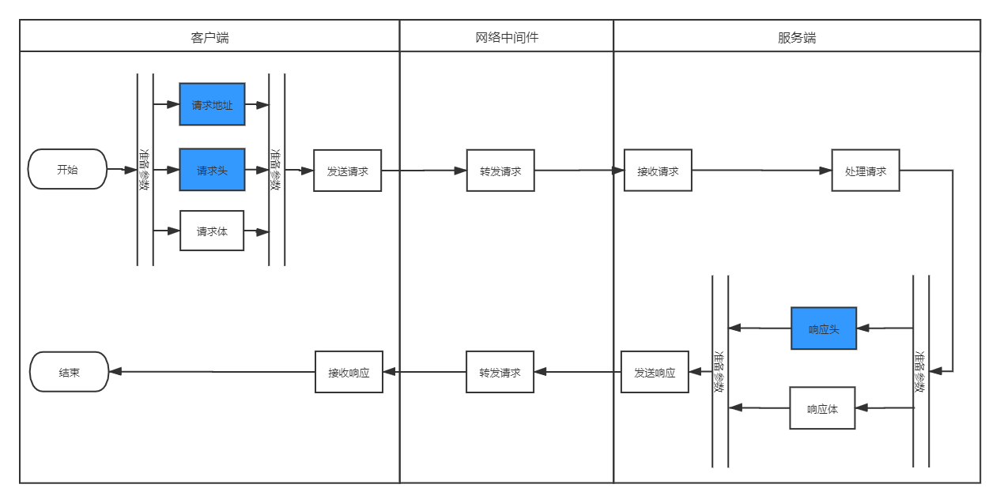

# restful 接口设计指南

## 关于本文档

### 编写目的

本文希望通过简要的介绍，能让读者对**restful接口设计**有初步的认识，并能按照实践指导设计符合rest标准的接口，对于不符合设计标准的接口，拥有一定的鉴别力和修改思路。

### 期望读者

任何对restful 接口设计感兴趣的同学，拥有接口设计经验者更佳，了解http协议者更秀。

## restful是什么？
**REST**全称是**Representational State Transfer**，中文意思是表述性状态转移。
这是一个谓宾短语。
我认为更易理解的表述应该是 **资源状态转移** 。

如何理解呢？解释如下：

restful风格认为:
1. 服务端定义的都是资源（面向对象思想）
2. 接口都是在进行资源的增删改查操作

下面详细介绍一下restful接口的设计

### 从http讲起

[点我放大图片](./restfulflow.png)

### restful的一些设计准则
其中带 * 项在现今场景一般并未实现
####   资源与URI
URI的设计应该遵循可寻址性原则，具有自描述性，需要在形式上给人以直觉上的关联。
即，能通过URI部分，推理出是在操作何种资源。
1. 使用_或-来让URI可读性更好
2. 使用/来表示资源的层级关系
3. 使用?用来过滤资源
4. ,或;可以用来表示同级资源的关系

####  统一资源接口
约定资源操作的**动词语义**与返回**状态码语义**。

一般来说，规定了四个动词
1. post 创建资源
2. put 修改资源
3. get 获取资源
4. delete 删除资源
   
同时约定了不同动词在不同响应结果发生时，应当返回的http状态码。

以下只列举了部分。

1. 200（OK）- 如果现有资源已被更改
2. 201（created）- 如果新资源被创建
3. 202（accepted）- 已接受处理请求但尚未完成（异步处理）
4. 301（Moved Permanently）- 资源的URI被更新
5. 303（See Other）- 其他（如，负载均衡）
6. 400（bad request）- 指代坏请求
7. 404 （not found）- 资源不存在
8. 500 （internal server error）- 通用错误响应
   
####  资源的表述
通过请求头来控制，所需的资源的表达返回方式

> 例如：
> 
> Accept:Application/xml; version=1.0,2.0 
> 
> 客户端期望响应体返回值是xml格式，并且期望的服务端版本是1.0或者2.0版本

####  资源的链接*

在返回结果里边加入链接来引导客户端。
在ajax盛行的年代，这一条经常并未实现

####  状态的转移
客户端调用**非安全接口** 后，产生的结果是资源状态的变更（转移）

## 为什么要使用restful规则来设计接口

## 如何设计restful接口

这里分步给出指导方案

## 特殊场景案例

### 异步长时操作

### 使用put来创建资源  

## 参考内容
[restful cook book](./RESTful+Web+Services+Cookbook++中文版_12879413.pdf)

